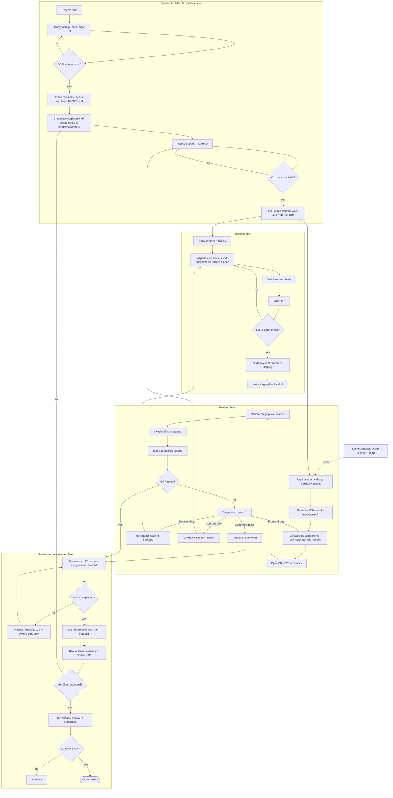

# WORKFLOW — AI-assisted, contract-first delivery

Corrected version of the original "Tech Model Process Workflow". Three human roles (Solution Architect & Lead Manager, Backend Dev, Frontend Dev), each using AI agents as a *tool*. The human in the lane is accountable for the agent's output. "Architect" below is shorthand for the Solution Architect & Lead Manager.

## Gates at a glance

| Gate | Name               | Owner                | Pass condition                                                             |
| ---- | ------------------ | -------------------- | -------------------------------------------------------------------------- |
| G0   | Brief approved     | Architect + client   | Scope, non-functional needs and open questions resolved; client signed off |
| G1   | Contract valid     | Architect            | `spectral lint` clean; Prism mock serves every endpoint                  |
| G2   | Contract frozen    | Architect            | Version tagged in `contracts/CHANGELOG.md`; handoff files written         |
| G3   | PR gates green     | CI                   | Lint, types, unit, contract tests (BE) / E2E-on-mocks (FE), security scan  |
| G4   | Integration passed | Frontend             | E2E green against staging                                                  |
| G5   | PR approved        | Architect            | Review checklist passed, per PR                                            |
| G6   | Client accepted    | Client via Architect | UAT sign-off on staging                                                    |
| G7   | Production healthy | Architect            | Post-deploy smoke passes, else rollback                                    |

## Diagram

## Phases in detail

### Phase 0 — Intake (Architect)

1. Save the brief to `briefs/<project>/brief.md` using the template.
2. List open questions in the brief; resolve with the client. **G0** blocks everything.

### Phase 1 — Architecture & contract (Architect)

1. Record stack and key decisions as ADRs (`architect/decisions/`).
2. Fill the *Project snapshot* in root `AGENTS.md` and tailor role files. (One rules step — there is no separate "write AI rules" step.)
3. Create `architect/backlog.md` **from the brief**. Every ticket has acceptance criteria and links to endpoint(s)/screen(s).
4. Author `contracts/openapi.yaml`. **G1**: `spectral lint` clean and a Prism mock serves all paths.
5. **G2**: bump version in `contracts/CHANGELOG.md`, then write handoffs. After this the contract only changes through a Contract Change Request.

### Phase 2 — Parallel build

Backend and frontend start at the same time. Neither waits for the other until the staging step.

**Backend:** feature branch → AI generates models/endpoints → unit tests **plus contract tests against the OpenAPI** → open PR → **G3** → CI deploys the PR branch to staging → write `staging-live` handoff.
Staging is never deployed from unreviewed, ungated code: the PR exists and CI is green first.

**Frontend:** consume design handoff (tokens, Figma) → generate MSW handlers **from the OpenAPI file** (never hand-written) → scaffold and integrate on mocks → open PR with E2E on mocks green → wait for `staging-live`.

### Phase 3 — Integration (Frontend drives)

Switch MSW off, run E2E against staging (**G4**). On failure, **triage** first:

| Class         | Meaning                      | Action                                     |
| ------------- | ---------------------------- | ------------------------------------------ |
| FRONTEND_BUG  | UI/logic error               | Frontend fixes                             |
| BACKEND_BUG   | API violates the contract    | Integration Issue handoff → Backend fixes |
| CONTRACT_FLAW | Contract is wrong/incomplete | Contract Change Request → Architect       |

AI auto-fix is allowed, **max 3 attempts per failure**. After the third, stop and escalate to the Architect with the log. No silent infinite loops.

### Phase 4 — Review (Architect)

1. Automated gates have already run (G3). The Architect does **not** re-check lint/tests; they check spec conformance using `architect/review-checklist.md`.
2. Backend and frontend PRs are reviewed **independently and in parallel**.
3. Change requests go **only to the owning side**; re-review only that PR.

### Phase 5 — Release (Architect)

1. **Merge order:** backend first (must be backward compatible with the old frontend), then frontend. Use feature flags if not compatible.
2. Deploy `main` to staging, run smoke tests.
3. **G6 client acceptance** (UAT). If rejected, new items go back to the backlog.
4. Tag release, deploy to production, run post-deploy smoke (**G7**). On failure: rollback per `architect/release-checklist.md`.

## Contract change loop

Anyone can propose; only the Architect approves. Steps: file Contract Change Request → Architect decides → update OpenAPI + bump `CHANGELOG.md` → re-lint (G1) → notify both sides with a handoff → affected tickets updated. Breaking changes bump the major version.

## Deviation rule

Developers may deviate from this workflow when the client's real need requires it. They must file a Deviation Report at the time (what rule, why, impact, who approved). The Architect reviews deviations at PR time and decides whether to promote them into the rules.
